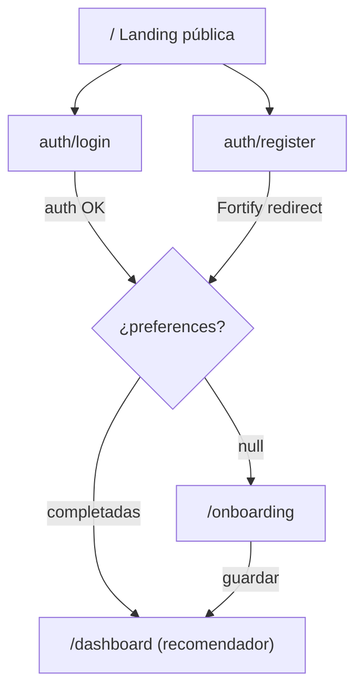

# Book Recommender App

## Arquitectura del flujo

## Cambios en Base de Datos

- **Nueva migración**: añadir columna `book_preferences` (nullable JSON) a `users`
- `**User` model** ([app/Models/User.php](app/Models/User.php)): añadir `book_preferences` a `$fillable` y cast `array`

## Backend

- `**OnboardingController**` (nuevo): `show()` renderiza el formulario, `store()` guarda preferencias y redirige a `/dashboard`
- `**OnboardingRequest**` (nuevo): valida que `genres` sea array con al menos 1 ítem y que `notes` sea string opcional
- `**EnsureOnboardingComplete` middleware** (nuevo): en rutas `auth`, si `book_preferences === null` redirige a `/onboarding`. Exime a `/onboarding` y `/settings/*`
- `**bootstrap/app.php**`: registrar el middleware como alias `onboarding`
- `**LibrarianAgent**` ([app/Ai/Agents/LibrarianAgent.php](app/Ai/Agents/LibrarianAgent.php)): añadir propiedad `$userPreferences` (array) usada en las instrucciones del agente para personalizar recomendaciones
- `**RecommendationController**` (nuevo): recibe el query del usuario, construye el prompt con sus preferencias y llama al `LibrarianAgent`
- `**routes/web.php**` ([routes/web.php](routes/web.php)): añadir rutas `/onboarding` (GET/POST con `auth` + `onboarding`), actualizar `/dashboard` para renderizar el recomendador, añadir `/recommendations` (POST, auth)

## Frontend

- `**pages/welcome.tsx**` — Landing moderna con: hero con CTA, sección de características (IA, personalización, búsqueda vectorial), y nav con login/registro. Diseño limpio con tipografía grande y paleta dark/light
- `**pages/onboarding.tsx**` — Formulario de preferencias: grid de tarjetas clickables para géneros (Ciencia Ficción, Fantasía, Misterio, Romance, Historia, Thriller, Terror, Clásicos...) + campo de texto libre para matices. Solo accesible tras login
- `**pages/dashboard.tsx**` — Interfaz del recomendador: campo de búsqueda semántica, botón "Recomendar", cards de resultado con título/autor/descripción/motivo. Estado de carga animado mientras espera la IA
- `**pages/auth/login.tsx**` ([resources/js/pages/auth/login.tsx](resources/js/pages/auth/login.tsx)) — Añadir separador "O continuar con" y botones de Google/GitHub como placeholders (links deshabilitados con tooltip "Próximamente")
- `**pages/auth/register.tsx**` — Igual que login, con botones sociales placeholder

## Tests

- `**tests/Feature/OnboardingTest.php**`: verifica que usuario sin preferencias es redirigido, que el formulario guarda correctamente y redirige al dashboard
- `**tests/Feature/RecommendationTest.php**`: verifica que el endpoint de recomendaciones requiere auth y que el formato de respuesta es correcto

## Notas

- El login social (Socialite) queda preparado a nivel UI con botones placeholder. La integración real requiere añadir `laravel/socialite` (necesita aprobación)
- El `Book` model no necesita cambios; el seeder tampoco
- `History` model queda sin cambios por ahora

